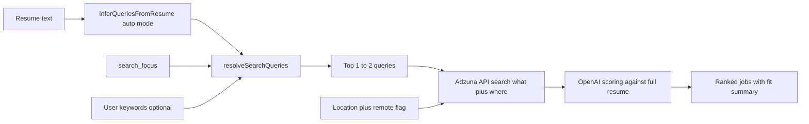
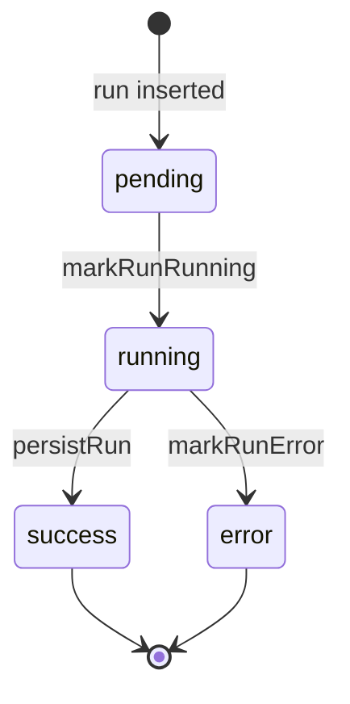

# RadarAI backend process (notes)

This is the current backend flow for the SaaS app (`web/`) with Adzuna-only live fetching.

## 1) End-to-end flow

```mermaid
flowchart TB
  subgraph user [User interaction]
    Form[Demo or dashboard form submit]
    Poll[Results page polls run status]
  end

  subgraph entry [Server entrypoints]
    DemoAction[startDemoRun]
    ManualRun[POST /api/profiles/id/run]
    CronRun[GET /api/cron/radar]
  end

  subgraph prep [Run setup]
    CreateRun[Insert runs row status pending]
    AfterCall[Run engine via after()]
  end

  subgraph engine [Engine pipeline]
    ResolveQ[resolveEngineQueries]
    Fetch[fetchSources Adzuna]
    Seen[loadSeenAndFilter]
    Clean[cleanJobs]
    Prioritize[prioritizeJobsForScoring]
    Score[scoreWithOpenAI]
    Post[postProcessScores]
    Persist[persistRun]
    Notify[dispatchNotifications optional]
  end

  subgraph ui [Client visibility]
    RunsAPI[GET /api/runs/id]
    Done[Render ranked jobs and summary]
  end

  Form --> DemoAction
  Form --> ManualRun
  CronRun --> CreateRun
  DemoAction --> CreateRun
  ManualRun --> CreateRun
  CreateRun --> AfterCall --> ResolveQ --> Fetch --> Seen --> Clean --> Prioritize --> Score --> Post --> Persist --> Notify
  Poll --> RunsAPI --> Done
  Persist --> RunsAPI
```

## 2) Query and relevance flow (resume-aware)



## 3) Run state lifecycle



## 4) Main backend files

- `web/app/demo/actions.ts`
- `web/app/api/profiles/[id]/run/route.ts`
- `web/app/api/runs/[id]/route.ts`
- `web/app/api/cron/radar/route.ts`
- `web/lib/engine/run-engine.ts`
- `web/lib/engine/fetch-sources.ts`
- `web/lib/engine/score-with-openai.ts`
- `web/lib/engine/persist-run.ts`
- `web/lib/engine/dispatch-notifications.ts`

## 5) Current live source assumptions

- Live source: Adzuna (`ADZUNA_APP_ID`, `ADZUNA_APP_KEY`, `ADZUNA_COUNTRY`)
- No RapidAPI requirement in live fetch path
- Demo mode remains available with `ENGINE_MODE=mock`
