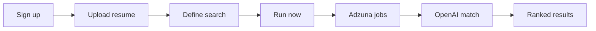

# Product Hunt launch guide

## What RadarAI is

Resume-aware job search: real listings (Adzuna) → cleaned and deduped → top matches scored and explained with OpenAI (fit, gaps, talking points).

**Free tier:** 3 AI-powered searches per day. **Pro:** field previews masked; paid digests not shipped yet.

---

## Production checklist

| Done by | Item |
|---------|------|
| Agent / script | `ADZUNA_*` + OpenAI vars on Vercel; `ENGINE_MODE` not pushed from local |
| **You** | Run `0007_user_usage.sql` in Supabase |
| **You** | Google + GitHub OAuth ([AUTH_OAUTH_SETUP.md](AUTH_OAUTH_SETUP.md)) |
| **You** | Supabase Site URL + `/auth/callback` redirect |
| **You** | End-to-end smoke test on production |

Full handoff: **[MVP_COMPLETE.md](MVP_COMPLETE.md)**

---

## Suggested PH positioning

**Tagline:** AI job search that explains why each role fits your resume.

**First comment (maker):**

> RadarAI is a free beta for active job seekers. Upload your resume, run a search, and get plain-English role summaries plus an honest experience comparison for each match — powered by live job data and GPT-4o-mini scoring.  
> Free plan: 3 searches/day. We're collecting feedback on match quality before Pro (scheduled digests).

**Don’t claim:** unlimited searches, multi-board LinkedIn scrape, paid checkout, daily email radar (not built).

---

## Assets to prepare

1. **Gallery:** Landing hero, onboarding, results with one job expanded.
2. **Video (optional):** 30s — sign up → run → scroll fit summary.
3. **Link:** https://web-ashen-sigma-71.vercel.app/sign-up

---

## Workflow (for your listing copy)

---

## After launch

- Watch Vercel function logs for Adzuna 429 / OpenAI errors.
- Monitor Supabase auth errors if sign-ups fail.
- Triage feedback on match quality before Stripe.
